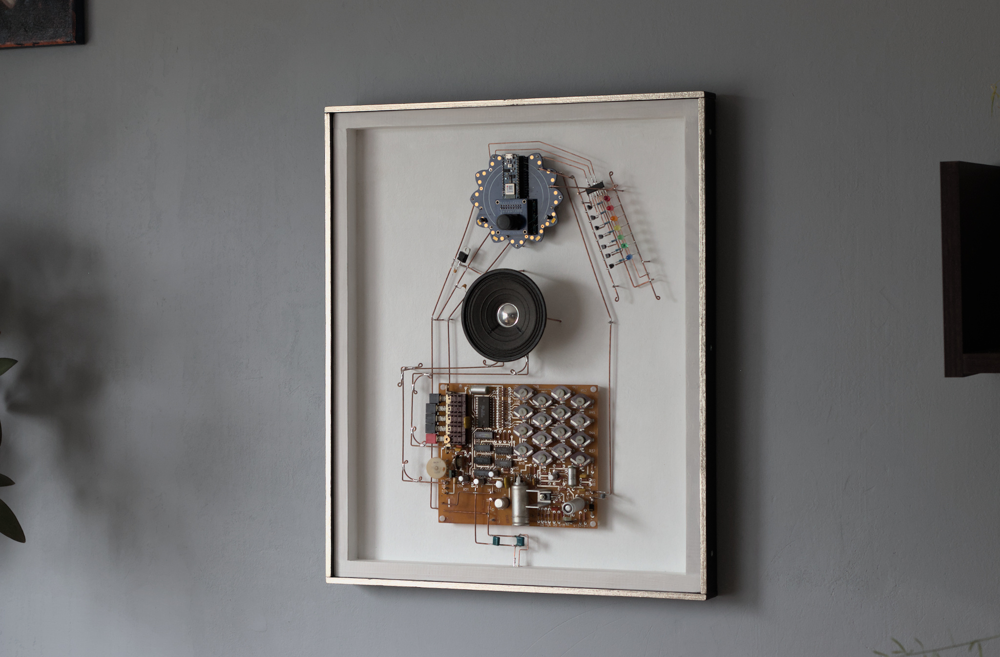
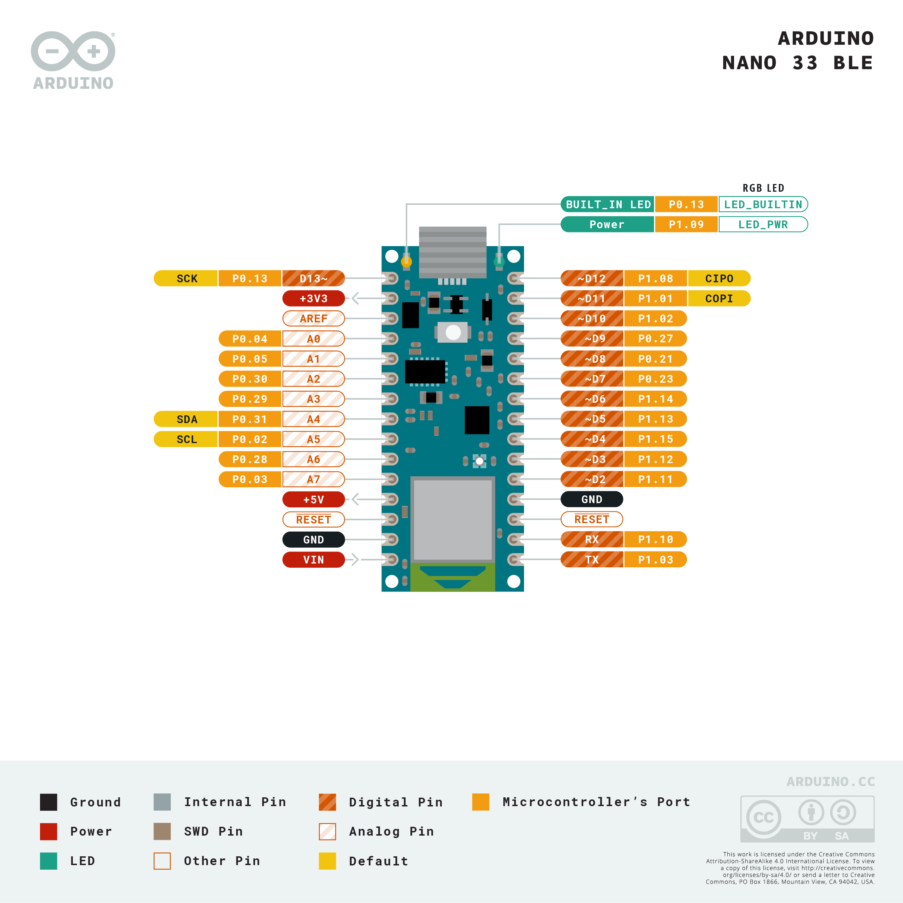
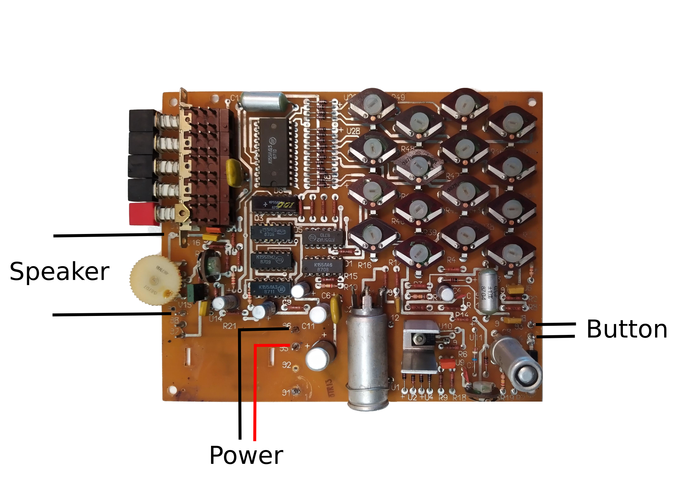
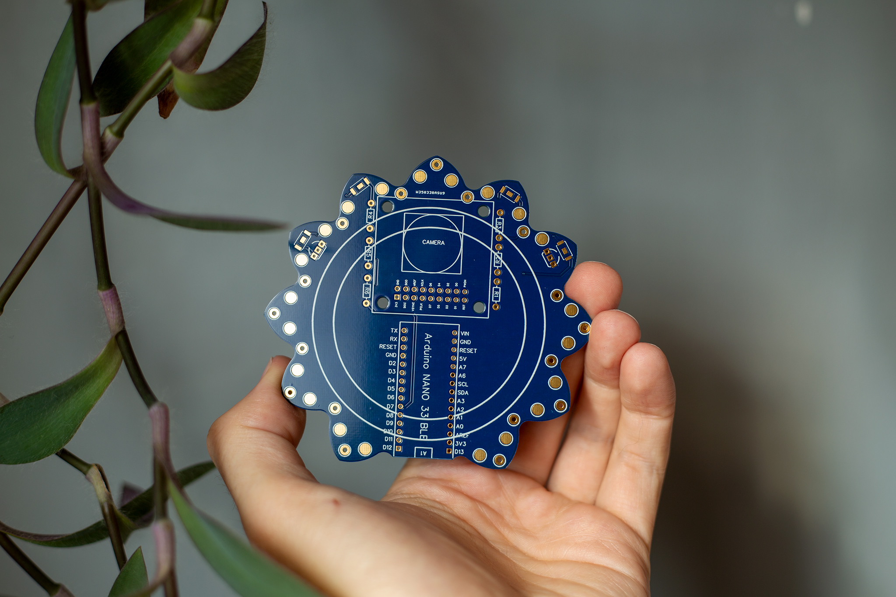
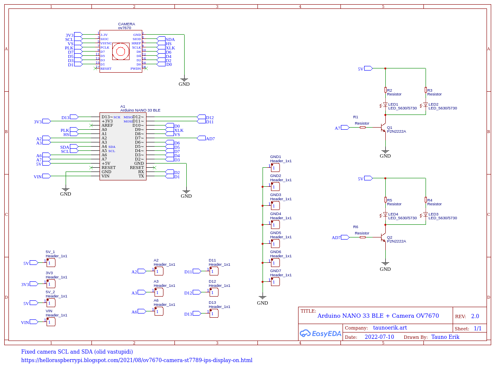
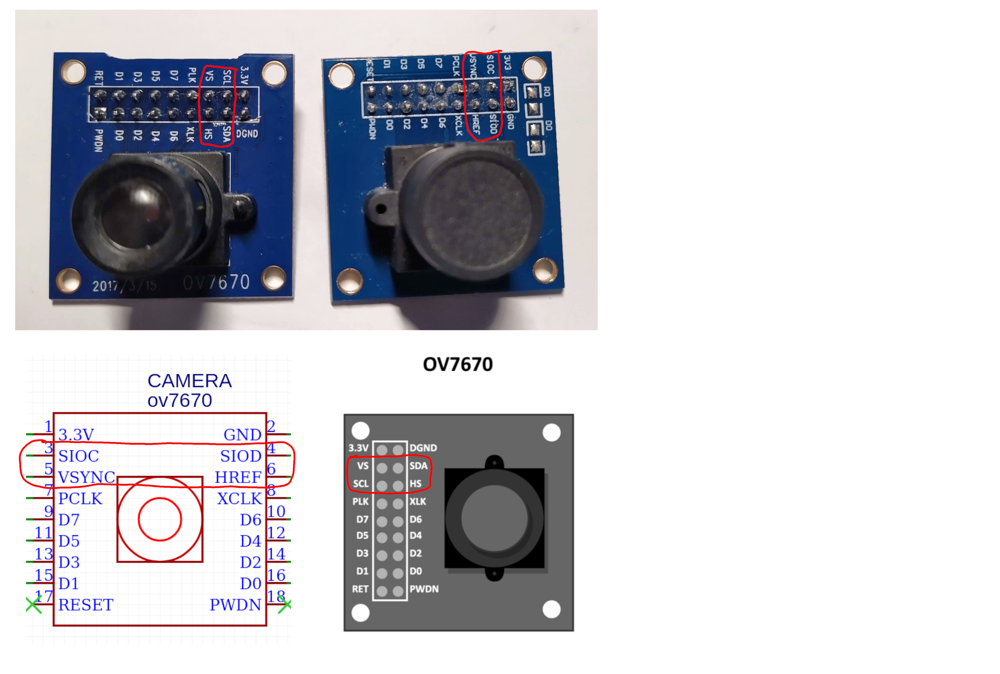
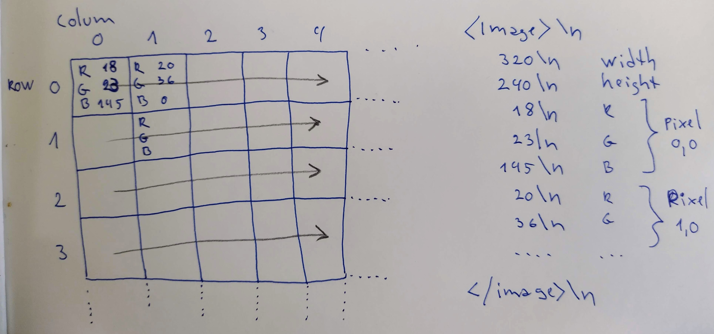

# The Blue Flower

Electronic sculpture with machine vision

## Parts

### Arduino Nano BLE Sense

MCU:

- The nRF52840 from Nordic Semiconductors, 32-bit ARM® Cortex®-M4 CPU running at 64 MHz.
- Operating voltage 3.3V
- Input voltage 21V (VIN pin)
- Bluetooth® pairing via NFC and ultra-low power consumption modes. [ArduinoBLE](https://www.arduino.cc/reference/en/libraries/arduinoble/)

On-board sensors:

- 9 axis inertial sensor: [LSM9DS1 datasheet](https://content.arduino.cc/assets/Nano_BLE_Sense_lsm9ds1.pdf)
- humidity, and temperature sensor [HTS221 datasheet](https://content.arduino.cc/assets/Nano_BLE_Sense_HTS221.pdf)
- barometric sensor [LPS22HB datasheet](https://content.arduino.cc/assets/Nano_BLE_Sense_lps22hb.pdf)
- digital microphone [MP34DT05-A datasheet](https://content.arduino.cc/assets/Nano_BLE_Sense_mp34dt05-a.pdf)
- gesture, proximity, light color and light intensity sensor [APDS-9960](https://content.arduino.cc/assets/Nano_BLE_Sense_av02-4191en_ds_apds-9960.pdf)

### USSR electronic doorbell

I have this USSR electronic doorbell. Made on 1987 (or 1981).

### PCB

Custom-made PSB. Manufacturer [PCBWay](https://www.pcbway.com/setinvite.aspx?inviteid=432220).

### OV7670 camera

p. 163.

Since microcontrollers have limited memory, it is a good choice because it is capable of transferring low-resolution images.

Output is QVGA (320x240) and QQVGA (160x120) pictures. QQQVGA (80x60).

Can encode images in different colour formats: RGB565, RGB444 and YUCbCr422.

OV7670 camera is initialized to output images in the RGB565 color format.

**NB! Pin layout may be different on different camera modules!**

#### Metadata

Metadata helps to simplify the parsing and check communication errors.

- The beginning of the image: `<image>` string
- The image resolution
- The end of image: `</image>` string

The pixel values will be sent right after the image resolution metadata and following the
raster scan order (top to bottom, left to right order).

The color components will be sent as strings of digits terminated with a newline character
`\n` and following the RGB ordering.

#### RGB565

RGB565 packs the pixel values in 2 bytes (16 bits). Used in embedded systems with limited memory since it reduces the image size. It also reduces the dynamic range of the color components.

- 5 bits red
- 6 bits green
- 5 bits blue

Need a buffer of 153.6 KB, which is roughly 60% SRAM available on Arduino Nano 33.

#### RGB888

#### YCbCr422

YCbCr422 is digital color encoding that does not express the pixel color in terms of red (R), green (G) and blue (B) intensities but rather in terms of brightness (Y), blue-difference (Cb), and red-difference (Cr) chroma components.

In YCbCr422 format, Cb and Cr are shared between two consecutive pixels on the same scanline. Therefore, 4 bytes are used to encode 2 pixels. Although YCbCr422 still needs 2 bytes per pixel as RGB565, it offers better image quality.

OV7670 driver returns the Cr component before the Cb one.

The OV7670 driver interchanges YCbCr422 with YUV422, leading to some confusion. The main difference between YUV and YCbCr is that YUV is for analog TV. Therefore, although we pass YUV422 to `Camera.begin()`, we actually initialize the device for YCbCr422.

#### Example codes

- https://github.com/PacktPublishing/TinyML-Cookbook/blob/main/Chapter05/ArduinoSketches/01_camera_capture.ino
- https://github.com/PacktPublishing/TinyML-Cookbook/blob/main/Chapter05/ArduinoSketches/02_camera_capture_qvga_rgb565.ino
- https://github.com/PacktPublishing/TinyML-Cookbook/blob/main/Chapter05/ArduinoSketches/03_camera_capture_qqvga_ycbcr422.ino

## ML

- [List of pre-trained models offered by Keras](https://keras.io/api/applications/)

## Books

- [TinyML Cookbook: Combine artificial intelligence and ultra-low-power embedded devices to make the world smarter](https://www.packtpub.com/product/tinyml-cookbook/9781801814973), Gian Marco Iodice, 2022, Packt, ISBN9781801814973 

## Links

- https://docs.arduino.cc/hardware/nano-33-ble
- https://docs.arduino.cc/tutorials/nano-33-ble-sense/cheat-sheet
- https://community.element14.com/products/roadtest/b/blog/posts/review-of-development-board-arduino-nano-33-ble-sense-roadtest

 ___

Copyright, 2022, Tauno Erik, [taunoerik.art](https://taunoerik.art). Made in :estonia:, Слава Україні! Героям Слава! :ukraine: